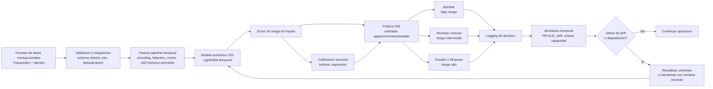
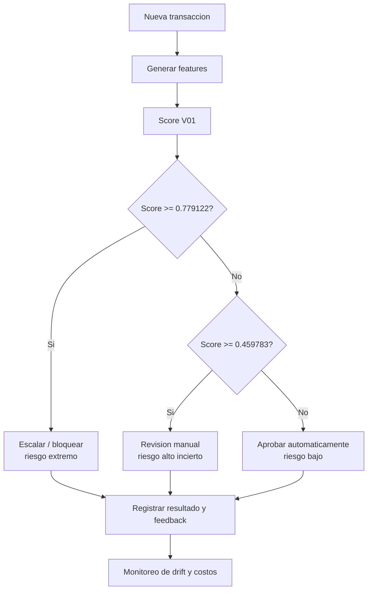

# Arquitectura del sistema

## Arquitectura end-to-end

## Modulos exigidos por la rubrica

| Modulo | Funcion | Evidencia del proyecto |
| --- | --- | --- |
| Adquisicion e integracion | Recibe transacciones y atributos de identidad, une fuentes y valida estructura. | Kernels EDA/V01 integran transaction e identity. |
| Preparacion temporal | Ordena por `TransactionDT`, evita leakage y construye features permitidas. | V01 excluye tiempo absoluto como predictor. |
| Modulo predictivo | Estima score de fraude. | V01 LightGBM, holdout PR-AUC 0.5436. |
| Manejo de incertidumbre | Calibra score si se comunica como probabilidad. | V06 reduce Brier en holdout de 0.0479 a 0.0219. |
| Modulo de decision | Convierte score en accion. | V05: approve/review/escalate. |
| Componente de accion | Aprueba, envia a revision o escala. | Politica V05 reduce costo frente a reglas simples. |
| Monitoreo | Mide drift y degradacion temporal. | V03 feature audit, V06 sensibilidad. |
| Adaptacion | Recalibra, ajusta umbrales o reentrena. | Protocolo propuesto con ventanas deslizantes. |

Los modulos V05 y V06 estan publicados tambien como kernels Kaggle autocontenidos, por lo que la politica y la auditoria de robustez son reproducibles fuera del entorno local.

## Flujo de decision

## Particion temporal

```mermaid
gantt
    title Particion temporal usada en modelado
    dateFormat  X
    axisFormat  %s
    section Dataset ordenado por TransactionDT
    Train 70%       :train, 0, 70
    Validacion 15%  :valid, 70, 15
    Holdout 15%     :holdout, 85, 15
```

