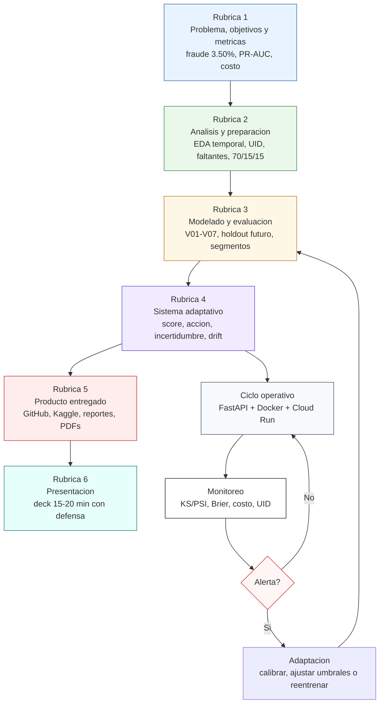

# Infografia final en Mermaid

Esta infografia resume la entrega segun la rubrica del curso y conecta esa evidencia con el ciclo operativo del sistema adaptativo. La version final en LaTeX/PDF usa el mismo mensaje: problema, datos, modelado, sistema adaptativo, producto y presentacion.

## Mensaje para exposicion

La infografia debe ayudar al profesor a ver rapidamente que la entrega cubre la rubrica completa. El sistema aprende de datos historicos, decide bajo restricciones operativas, monitorea drift y actualiza umbrales o modelo cuando el entorno cambia. La trazabilidad queda respaldada por kernels publicos de Kaggle para EDA y V01-V07.
