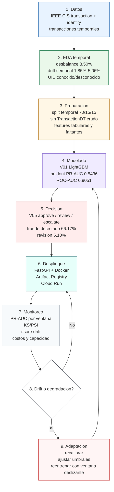

# Infografia final en Mermaid

Esta infografia resume el ciclo de vida completo del sistema inteligente adaptativo.

## Mensaje para exposicion

El sistema no es un clasificador estatico. Es un ciclo adaptativo: aprende de datos historicos, decide bajo restricciones operativas, monitorea drift y actualiza umbrales o modelo cuando el entorno cambia.
