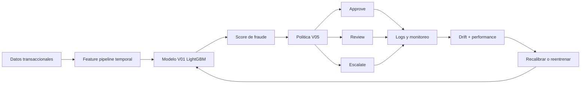
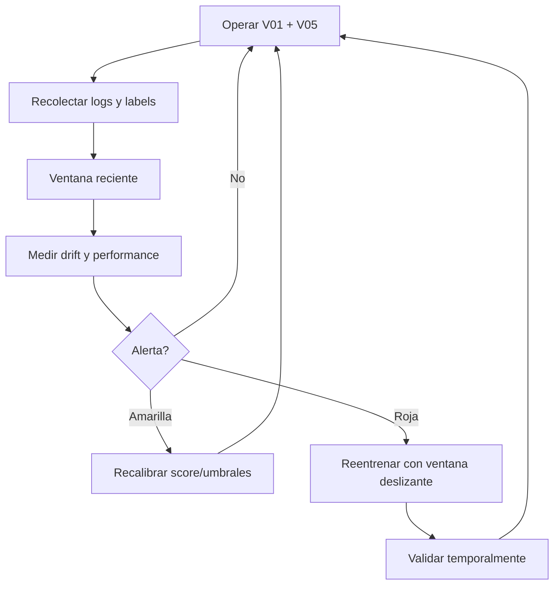

# Informe tecnico - Sistema adaptativo de deteccion de fraude

> **Borrador histórico V01–V07.** Sus costos normalizados de V05 y porcentajes de revisión no corresponden a la simulación final con cupo diario. Para entregar o citar resultados actuales, use `final/REPORTE.md` y `07_latex/informe.pdf`.

## 1. Problema y caso de uso

El proyecto desarrolla un sistema inteligente adaptativo para deteccion de fraude financiero usando el dataset IEEE-CIS Fraud Detection. El sistema recibe una transaccion electronica, estima su riesgo de fraude y toma una decision operativa: aprobar, enviar a revision manual o escalar/bloquear temporalmente.

El problema es relevante porque el fraude cambia en el tiempo. Los atacantes modifican patrones, los clientes cambian comportamiento y la distribucion de las variables no permanece fija. Por ello, el sistema no puede evaluarse como un clasificador estatico con split aleatorio; debe respetar el orden temporal y contemplar concept drift.

Los experimentos EDA y V01-V07 quedaron publicados como kernels publicos de Kaggle y sus outputs fueron descargados al repositorio. Esto permite auditar codigo, particiones, resultados y reportes asociados a cada decision. El informe se organiza para cubrir la rubrica del curso: problema, datos, modelado, sistema adaptativo, producto entregable y presentacion.

## 2. Objetivos, restricciones y metricas

| Elemento | Definicion |
| --- | --- |
| Objetivo tecnico | Detectar fraude en un dataset altamente desbalanceado. |
| Objetivo operativo | Transformar el score en acciones: approve, review, escalate. |
| Objetivo adaptativo | Monitorear drift y definir mecanismos de recalibracion/reentrenamiento. |
| Restriccion temporal | No mezclar pasado y futuro en entrenamiento/evaluacion. |
| Restriccion operativa | Mantener revision manual alrededor de 5% de transacciones. |
| Restriccion social | Reducir friccion injustificada y evitar automatizar casos ambiguos. |

Metricas usadas:

- tecnicas: PR-AUC, ROC-AUC, Brier score y desempeno por segmento;
- decision: costo por transaccion, fraude detectado, tasa de revision y tasa de escalamiento;
- sociales: legitimas escaladas, cobertura por UID conocido/desconocido y tasa de aprobacion automatica.

PR-AUC se usa como metrica principal porque el fraude representa solo 3.50% del train. En datos desbalanceados, accuracy puede ser alta aunque el modelo no detecte fraudes.

## 3. Analisis de datos

El EDA propio encontro:

- 590,540 filas en train y 506,691 en test;
- tasa de fraude en train de 3.50%;
- tasa semanal de fraude variable entre 1.85% y 5.06%;
- fuerte separacion temporal train/test mediante adversarial validation;
- 74 features con mas de 80% de faltantes;
- diferencia de riesgo entre UID conocido y UID desconocido.

Estas evidencias justifican:

- split temporal 70/15/15;
- no usar `TransactionDT` como predictor;
- reportar metricas por UID conocido/desconocido;
- monitorear drift en features, scores y performance;
- no eliminar outliers de monto, porque los montos extremos tienen mayor tasa de fraude.
- incorporar `TransactionAmt_multi_decimal` en V07 como senal simple sugerida por el EDA de referencia.

El EDA de referencia de Fabryzzio se uso como complemento metodologico, no como fuente de resultados finales. Se revisaron sus observaciones sobre identity, bloques V, monto, UID y MLP, pero las metricas finales se recalcularon con nuestro split temporal para mantener comparabilidad con V01-V07.

## 4. Preparacion y validacion temporal

Las transacciones se ordenaron por `TransactionDT`. Se uso 70% inicial como entrenamiento, 15% siguiente como validacion y 15% final como holdout futuro. `TransactionDT`, `DT_day_index` y `DT_week_index` se excluyeron como predictores porque codifican posicion temporal absoluta.

```mermaid
gantt
    title Split temporal
    dateFormat  X
    axisFormat  %s
    section IEEE-CIS ordenado por TransactionDT
    Train 70%       :train, 0, 70
    Validacion 15%  :valid, 70, 15
    Holdout 15%     :holdout, 85, 15
```

## 5. Modelado y comparacion

El modelo base V01 fue LightGBM con 185 features. Se eligio porque el dataset es tabular, grande, con numericas, categoricas codificadas, faltantes e interacciones no lineales.

| Version | Objetivo | Resultado | Decision |
| --- | --- | --- | --- |
| V01 | Baseline temporal LightGBM | Holdout PR-AUC 0.5436 | Modelo base |
| V01b | Todas las features | Holdout PR-AUC 0.5303 | No reemplaza V01 |
| V02 | UID historicas | Mejora UID conocido, empeora UID desconocido | No adoptar como modelo unico |
| V03 | Auditoria de features | 44 keep, 9 monitor | Usar para monitoreo |
| V04 | LightGBM/XGBoost/CatBoost auditados | Ninguno supera V01 | Mantener V01 |
| V05 | Politica approve/review/escalate | Costo holdout 1.3680 | Politica operativa |
| V06 | Robustez y calibracion | Brier 0.0479 a 0.0219 | Auditoria y calibracion |
| V07 | MLP y baseline tradicional | MLP holdout PR-AUC 0.2218 | No reemplaza V01 |

Cada version responde a una pregunta de decision. V01 fija la referencia, V01b prueba si usar todas las variables mejora, V02 evalua memoria de UID, V03 audita variables, V04 compara modelos tabulares, V05 convierte score en accion, V06 mide incertidumbre y V07 compara MLP y baseline lineal. Esta secuencia documenta el proceso completo, no solo el modelo ganador.

Resultados V01:

| Segmento | Fraud rate | PR-AUC | ROC-AUC |
| --- | ---: | ---: | ---: |
| Validacion global | 3.43% | 0.5954 | 0.9257 |
| Holdout global | 3.48% | 0.5436 | 0.9051 |
| Holdout UID conocido | 1.93% | 0.5159 | 0.9020 |
| Holdout UID desconocido | 4.73% | 0.5632 | 0.8933 |

La caida de validacion a holdout confirma degradacion temporal. Aun asi, V01 fue el modelo mas robusto entre los comparados.

V07 agrego un MLP Keras ponderado y una regresion logistica SGD. En holdout, el MLP obtuvo PR-AUC 0.2218 y la regresion 0.1638, por debajo de la referencia LightGBM de V07 con 0.5313. Por eso V07 cierra la comparacion experimental, pero no cambia la seleccion del modelo.

## 6. Modulo de decision

El score del modelo se convirtio en una politica de tres acciones:

| Accion | Criterio | Funcion |
| --- | --- | --- |
| approve | score menor a 0.459783 | Aprobar automaticamente |
| review | score entre 0.459783 y 0.779122 | Revision humana |
| escalate | score mayor o igual a 0.779122 | Escalar/bloquear temporalmente |

Costos normalizados:

- fraude aprobado: 100;
- legitima escalada: 10;
- revision manual: 2;
- capacidad maxima de revision: 5%.

Resultado V05 en holdout:

| Politica | Costo/txn | Fraude detectado | Revision | Escalamiento |
| --- | ---: | ---: | ---: | ---: |
| Aprobar todo | 3.4804 | 0.00% | 0.00% | 0.00% |
| Revisar top 5% | 1.5247 | 59.20% | 5.23% | 0.00% |
| Escalar top 1% | 2.5959 | 25.75% | 0.00% | 1.01% |
| V05 | 1.3680 | 66.17% | 5.10% | 2.48% |

V05 se adopta como primera politica operativa porque reduce costo y detecta mas fraude que reglas simples.

V05 se ejecuto tambien como kernel publico autocontenido: reentrena el score base y genera umbrales, decisiones y comparaciones de politica. Esto evita depender solo de archivos locales.

## 7. Arquitectura y despliegue

El despliegue propuesto sigue el taller de GCP:

1. API con FastAPI;
2. contenedor Docker;
3. Artifact Registry para imagen versionada;
4. Cloud Build desde GitHub;
5. Cloud Run como servicio serverless;
6. Cloud Logging y Cloud Monitoring para auditoria y drift.

Cloud Run es adecuado porque sirve contenedores HTTP, escala segun demanda y reduce administracion de infraestructura.

## 8. Drift y adaptacion

El sistema monitorea:

- drift de features: KS/PSI y missingness;
- drift de scores: percentiles y tasa sobre umbral;
- performance con labels tardios: PR-AUC, recall, costo;
- operacion: revision, escalamiento y legitimas escaladas;
- segmentos: UID conocido/desconocido.

V06 mostro que el score bruto no esta calibrado: en holdout el score promedio fue 14.30% mientras la tasa real fue 3.48%. La calibracion isotonica redujo Brier de 0.0479 a 0.0219. Por eso el score bruto se usa para ranking y umbrales, pero el score calibrado se recomienda para comunicar probabilidad.

V06 tambien fue ejecutado como kernel publico autocontenido. Sus outputs confirman la sensibilidad de costos y la comparacion entre politica global y politica segmentada por UID.

## 9. Cobertura de rubrica

| Criterio | Evidencia incluida |
| --- | --- |
| Problema, objetivos, restricciones y metricas | Caso de fraude, PR-AUC, costos, revision, escalamiento y calibracion. |
| Analisis y preparacion | EDA temporal, faltantes, UID, adversarial validation y split 70/15/15. |
| Modelado y evaluacion | V01-V07, holdout futuro, comparacion de modelos y segmentos UID. |
| Sistema adaptativo | Arquitectura, acciones, incertidumbre, drift, calibracion y reentrenamiento. |
| Producto entregado | GitHub, kernels publicos, reportes, informe, presentacion e infografia. |
| Presentacion | Deck ampliado para 15-20 minutos con justificacion de decisiones. |

## 10. Limitaciones

| Limitacion | Control |
| --- | --- |
| Costos normalizados | Repetir sensibilidad con costos reales. |
| Datos anonimizados | Interpretar variables como senales, no causas. |
| Revision supera levemente 5% en holdout | Usar percentiles o recalibracion por ventana. |
| UID features no adoptadas | Explorar modelos segmentados en trabajo futuro. |
| Drift temporal | Monitoreo y reentrenamiento con ventanas deslizantes. |

## 11. Conclusion

La recomendacion final es usar V01 como modelo base, V05 como politica operativa y V06 como soporte de calibracion/robustez. El sistema no se plantea como un clasificador estatico: se plantea como un ciclo adaptativo que aprende, decide, monitorea y actualiza su comportamiento ante drift.
