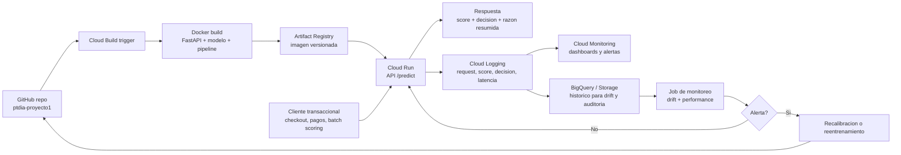
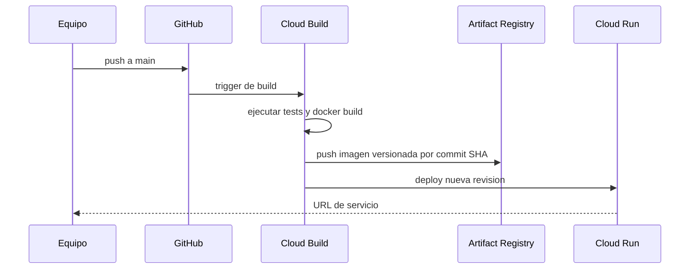

# Propuesta de despliegue en GCP

> **Propuesta histórica.** Existe una API desplegada descrita en `serving/README.md`; esa API todavía no aplica el cupo diario de la simulación final. Use `final/REPORTE.md` para el estado actual.

## Base usada

El taller de despliegue propone un flujo practico:

1. elegir o empaquetar un modelo;
2. envolverlo en una API;
3. crear una imagen Docker reproducible;
4. subir la imagen a Artifact Registry;
5. desplegar en Cloud Run;
6. monitorear logs y costos.

Para este proyecto, ese flujo se adapta a un sistema de fraude tabular con LightGBM, politica de decision y monitoreo de drift.

La version de referencia para desplegar es V01 como modelo predictivo, V05 como politica de decision y V06 como soporte de calibracion/robustez. Las tres piezas tienen artefactos versionados en el repositorio y V05/V06 fueron ejecutadas como kernels publicos autocontenidos.

## Arquitectura de despliegue



## API propuesta

### Endpoint principal

`POST /predict`

Entrada conceptual:

```json
{
  "transaction": {
    "TransactionAmt": 68.77,
    "ProductCD": "W",
    "card1": 12345,
    "card2": 321.0,
    "addr1": 299.0,
    "P_emaildomain": "gmail.com"
  },
  "identity": {
    "DeviceType": "mobile",
    "id_01": -5.0
  },
  "metadata": {
    "event_time": "2026-09-19T12:00:00-05:00"
  }
}
```

Salida conceptual:

```json
{
  "fraud_score": 0.62,
  "calibrated_probability": 0.08,
  "decision": "review",
  "policy_version": "v05",
  "model_version": "v01",
  "review_threshold": 0.459783,
  "escalate_threshold": 0.779122
}
```

## Componentes

| Componente | Tecnologia propuesta | Motivo |
| --- | --- | --- |
| API | FastAPI | Simple para exponer `/predict`, documentacion automatica y baja friccion. |
| Modelo | LightGBM serializado | Modelo V01 vigente. |
| Politica | Funcion Python con umbrales V05 | Mantiene decision separada del modelo; kernel publico reproduce umbrales y resultados. |
| Contenedor | Docker | Reproducibilidad entre local y nube. |
| Build | Cloud Build | Automatiza construir imagen desde GitHub. |
| Registry | Artifact Registry | Almacena imagen Docker versionada. |
| Serving | Cloud Run | Serverless, escala a cero, apropiado para API HTTP. |
| Logs | Cloud Logging | Trazabilidad de predicciones y errores. |
| Monitoreo | Cloud Monitoring + BigQuery/Storage | Drift, latencia, costos, tasa de revision. |
| Calibrador | Isotonic regression opcional | V06 muestra que el score bruto rankea, pero no debe comunicarse como probabilidad. |

## Flujo CI/CD



## Cloud Run

Cloud Run es adecuado para esta primera propuesta porque:

- ejecuta contenedores HTTP;
- permite escalar segun demanda;
- puede escalar a cero si no hay trafico;
- registra logs integrados;
- simplifica despliegue frente a administrar servidores.

El taller muestra esta misma logica para un modelo NLP: API, Docker, Artifact Registry y Cloud Run. En nuestro caso, el modelo no es DistilBERT sino un pipeline tabular LightGBM.

## Frecuencia de actualizacion

| Elemento | Frecuencia propuesta | Criterio |
| --- | --- | --- |
| Umbrales de politica | Semanal o cuando revision exceda capacidad | Mantener cola alrededor de 5%. |
| Calibracion | Mensual o ante drift de score | Score bruto esta mal calibrado segun V06. |
| Modelo | Mensual o gatillado por drift rojo | Evitar reentrenar por ruido. |
| Dashboard | Diario/semanal | Seguimiento operativo. |

## Nivel de autonomia

| Decision | Autonomia propuesta | Justificacion |
| --- | --- | --- |
| Aprobar bajo riesgo | Automatica | Reduce friccion y cubre mayoria de transacciones. |
| Revision de riesgo intermedio | Humana asistida | Evita automatizar casos inciertos. |
| Escalar riesgo alto | Semiautomatica | Puede bloquear temporalmente o requerir confirmacion adicional. |
| Cambio de modelo | Humana con validacion | Requiere auditoria y comparacion temporal. |

## Escalabilidad y costos

El taller compara costos de Cloud Run por CPU, memoria, requests, Artifact Registry y Cloud Build. Para este proyecto:

- la inferencia LightGBM es liviana frente a modelos grandes de lenguaje;
- el costo por request deberia ser bajo;
- el mayor costo operativo probablemente esta en revision humana, no en computo;
- Artifact Registry almacenaria imagenes pequenas comparadas con modelos deep learning;
- Cloud Logging/BigQuery pueden crecer si se guardan todas las transacciones, por lo que se debe definir retencion y muestreo.

## Riesgos de despliegue

| Riesgo | Control |
| --- | --- |
| Leakage en produccion | Pipeline de features solo usa informacion disponible al momento de la transaccion. |
| Drift silencioso | Monitoreo de scores, features, missingness y performance con labels tardios. |
| Exceso de revision | Umbral por percentil o recalibracion semanal. |
| Bloqueos injustos | Mantener revision humana y metricas de legitimas escaladas. |
| Exposicion de datos sensibles | IAM, logs minimizados, cifrado y control de acceso. |
| Dependencia de una version | Versionar modelo, politica y calibrador. |

## Comandos conceptuales de despliegue

```bash
# Build y push de imagen con Cloud Build
gcloud builds submit \
  --tag REGION-docker.pkg.dev/PROJECT_ID/ptdia/fraud-api:COMMIT_SHA

# Deploy en Cloud Run
gcloud run deploy fraud-risk-api \
  --image REGION-docker.pkg.dev/PROJECT_ID/ptdia/fraud-api:COMMIT_SHA \
  --region REGION \
  --platform managed
```

## Resultado esperado del despliegue

Un servicio HTTP que recibe una transaccion, genera features, calcula score, aplica politica V05 y devuelve una accion. Sus decisiones quedan registradas para monitoreo, auditoria y adaptacion ante drift.
