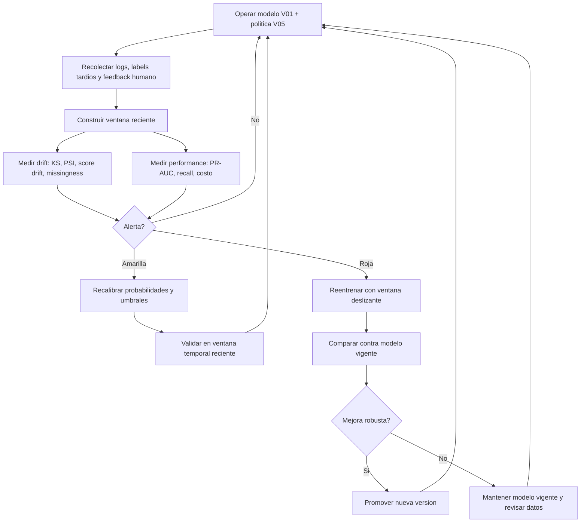

# Protocolo de deteccion y adaptacion al concept drift

> **Propuesta histórica.** La evaluación final ya ejecutó ventanas de 14, 30 y 45 días e historial acumulado. El protocolo y sus resultados actuales están en `final/REPORTE.md`.

## Objetivo

Definir como el sistema detecta cambios en la distribucion y como decide entre continuar operando, recalibrar umbrales o reentrenar el modelo.

El protocolo se basa en la literatura de concept drift, donde el problema aparece cuando cambia con el tiempo la relacion entre variables de entrada y variable objetivo. Para este proyecto, el drift es esperable porque el EDA encontro variacion semanal de fraude entre 1.85% y 5.06%, y el adversarial validation separo train/test con ROC-AUC 1.000.

## Ventanas de monitoreo

| Ventana | Uso |
| --- | --- |
| Ventana corta | Ultimos 7 dias o lote semanal. Detecta cambios rapidos. |
| Ventana media | Ultimos 30 dias o bloque mensual. Suaviza ruido. |
| Ventana historica | Periodo usado para entrenamiento o calibracion. Sirve como referencia. |

La rubrica prioriza estrategias basadas en olvido y ventanas deslizantes. Por eso, el monitoreo debe comparar la ventana reciente contra una ventana de referencia y no asumir que todo el historial tiene la misma validez.

## Senales monitoreadas

| Tipo | Senal | Metodo sugerido | Accion si se degrada |
| --- | --- | --- | --- |
| Distribucion de features | `TransactionAmt`, `D*n`, `C*`, dominios, missingness | KS para numericas, PSI para bins/categoricas, cambios de missingness | Revisar drift; marcar features `monitor`. |
| Distribucion de scores | Promedio, percentiles 90/95/99, tasa sobre umbral | Comparacion ventana reciente vs referencia | Recalibrar umbrales si la capacidad se rompe. |
| Desempeno con labels tardios | PR-AUC, recall, precision, costo | Evaluacion por ventana cuando llegan etiquetas | Reentrenar si cae sostenidamente. |
| Operacion | tasa de revision, tasa de escalamiento, legitimas escaladas | Dashboard semanal | Ajustar politica si excede capacidad o friccion. |
| Segmentos | UID conocido/desconocido | Metricas por segmento | Considerar politica segmentada si hay brecha persistente. |

## Umbrales de alerta propuestos

| Nivel | Condicion | Accion |
| --- | --- | --- |
| Verde | Metricas dentro de tolerancia. | Continuar operacion. |
| Amarillo | PR-AUC baja 5%-10% relativo, revision supera capacidad por poco, o KS/PSI moderado. | Recalibrar umbrales y revisar features con drift. |
| Rojo | PR-AUC baja mas de 10% relativo, costo sube fuerte, o revision/escalamiento excede capacidad sostenidamente. | Reentrenar con ventana reciente y validar contra holdout temporal. |

## Ciclo de adaptacion

## Estrategia de reentrenamiento

Se proponen tres escenarios:

| Estrategia | Descripcion | Ventaja | Riesgo |
| --- | --- | --- | --- |
| Periodica mensual | Reentrenar cada mes con los datos mas recientes disponibles. | Simple y auditable. | Puede reaccionar tarde a drift abrupto. |
| Ventana fija deslizante | Entrenar solo con los ultimos N dias/semanas. | Olvida datos viejos. | Puede perder patrones raros de fraude. |
| Gatillada por drift | Reentrenar solo si las alertas superan umbral. | Reduce costo operativo. | Depende de buenos detectores y labels oportunos. |

Recomendacion inicial: usar ventana fija deslizante mensual como estrategia base y gatillos de drift para adelantar recalibracion. Esto cumple el criterio del profesor sobre ventajas/ventanas fijas deslizantes y mantiene trazabilidad.

## Protocolo de promocion de modelo

Un nuevo modelo solo se promueve si:

1. Fue entrenado sin leakage temporal.
2. Supera o iguala V01 en holdout temporal reciente.
3. No empeora de forma importante UID desconocido.
4. Mantiene tasa de revision dentro de capacidad.
5. Reduce costo esperado o mejora deteccion bajo el mismo costo.
6. Tiene reporte de feature drift y calibracion.

## Relacion con resultados actuales

- V01 es el modelo vigente.
- V05 es la politica vigente.
- V06 muestra que los umbrales son sensibles a capacidad y costos.
- V03 identifica features que deben monitorearse: especialmente `D1n`, `D2n`, `D10n`, `D15n`, `C9`, `id_02`, `id_20`, `D11`, `id_01`.
- V05 y V06 tienen kernels publicos autocontenidos y outputs descargados, lo que permite auditar la politica y la calibracion.

## Referencias metodologicas

- Gama et al. (2014) define concept drift y clasifica estrategias adaptativas.
- Bifet y Gavalda (2007) proponen adaptive windowing, base conceptual para ventanas que olvidan informacion antigua.
- La documentacion de scikit-learn sobre validacion temporal respalda no mezclar pasado y futuro.
