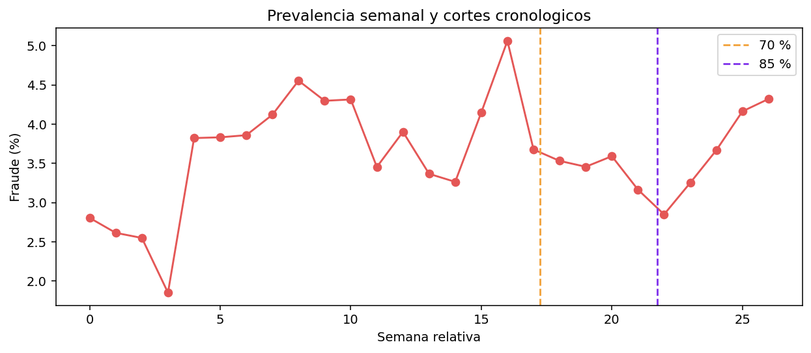
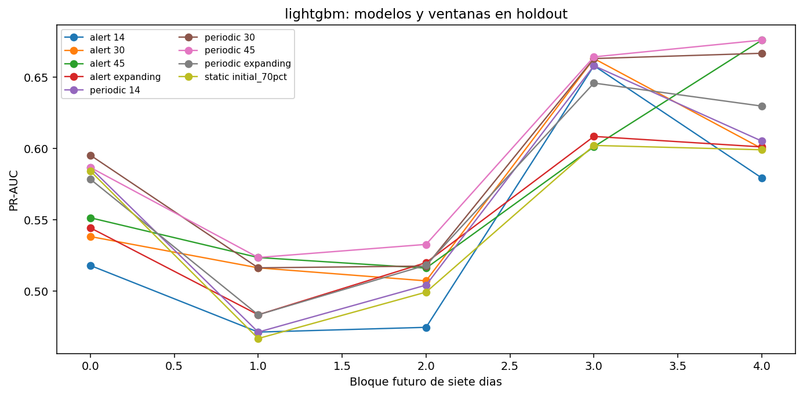
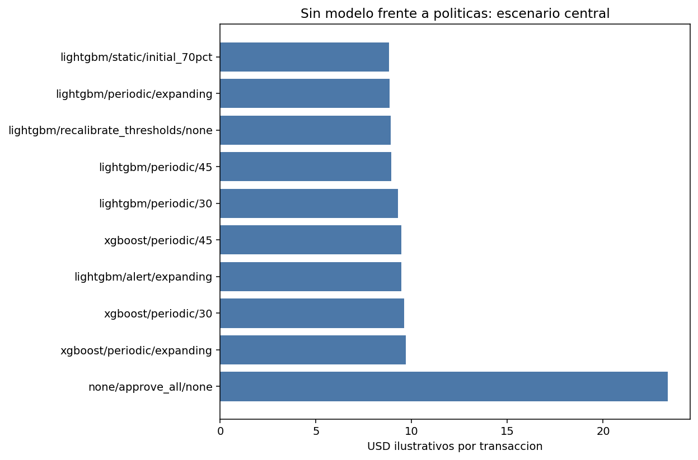
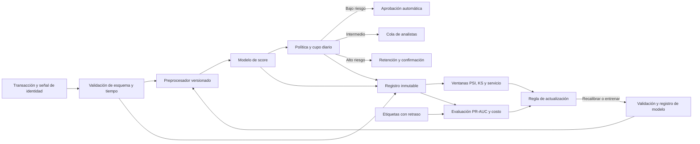

# Sistema temporal de decisión antifraude — IEEE-CIS

**Estado:** cuatro etapas completas y verificadas. Este documento separa resultados observados de supuestos de simulación. Las cuatro etapas se ejecutan secuencialmente en Kaggle y sus salidas se guardan bajo `final/kaggle/<etapa>/outputs/`. El monitoreo se ejecutó con T4; la versión final de EDA, los modelos y la política usan CPU porque Kaggle agotó la cuota semanal de GPU. El dispositivo efectivo de cada ajuste queda registrado.

## 1. Pregunta, objetivos y restricciones

La pregunta es si un clasificador y una política de revisión reducen la pérdida simulada frente a aprobar todas las operaciones, y si una actualización temporal añade valor frente a V01 estático. Priorizamos PR-AUC porque la prevalencia de fraude es baja. Medimos también recall y precisión al mismo cupo de revisión, pérdida por transacción, fraudes aprobados, escalaciones legítimas, cobertura por UID, tiempo de entrenamiento y de inferencia. Ningún costo monetario de este informe procede de una empresa real.

El archivo `train` tiene **590 540** transacciones etiquetadas, **20 663** fraudes (**3.499 %**). El `test` de competición tiene **506 691** filas sin `isFraud`. `TransactionDT` es un contador temporal relativo: train cubre los días 1–183; test, los días 213–396. Existe un hueco de unos 30 días entre archivos, por lo que no se mezclan para una métrica supervisada. La evaluación reproducible usa solo train, dividido cronológicamente 70/15/15: cortes en segundos relativos **10 437 998.1** y **13 151 846.0**. No se conoce la fecha de calendario ni el proceso real de llegada de etiquetas.

## 2. Datos, exploración y fuga

El [EDA](01_eda.ipynb) muestra desbalance, evolución semanal, faltantes, monto y tasas descriptivas por producto y dispositivo. La tasa semanal de fraude oscila entre **1.85 % y 5.06 %**, evidencia de que una cifra global oculta cambios. El [gráfico de clases](kaggle/eda/outputs/plots/01_clases.png), el [de prevalencia](kaggle/eda/outputs/plots/02_prevalencia_semanal.png), el [de faltantes](kaggle/eda/outputs/plots/03_faltantes.png) y las [distribuciones por clase de V258, C5 y D1](kaggle/eda/outputs/plots/06_variables_v01.png) se generaron con el dataset completo. Los CSV exactos están en [salidas EDA](kaggle/eda/outputs/).

Se excluyen `TransactionID`, `TransactionDT` absoluto y sus índices de día/semana de los 185 predictores de V01. `TransactionDT` sí ordena eventos, determina cortes y forma la hora de la transacción. Los cuartiles del indicador de monto atípico y los mapas/frecuencias categóricos se ajustan exclusivamente con la ventana histórica de cada actualización. La auditoría detectó un riesgo en V01: sus cuartiles del monto se habían calculado sobre todas las filas. Por ello V01 se conserva como referencia histórica exacta, y las variantes nuevas aplican el ajuste temporal corregido. Esa asimetría se midió en vez de suponerse: [`leakage_impact.py`](leakage_impact.py) entrena el mismo modelo dos veces —idéntico en semilla, hiperparámetros y las 185 variables— cambiando solo el origen de los cuartiles. Los cortes se desplazan de `(−80.13, 248.08)` con ajuste histórico a `(−79.20, 247.52)` con todas las filas, un **0.22 %** en el corte superior, y eso altera el valor de la variable en **6 de las 88 581 filas de holdout** (0.007 %). La PR-AUC de holdout resulta **0.51656 con fuga y 0.51910 sin ella**: la versión contaminada rinde **0.0025 peor**, no mejor. La fuga es real y debía declararse, pero no otorga ventaja detectable, de modo que la comparación entre V01 y las estrategias adaptativas no está sesgada a favor de V01 por esta vía. El [detalle](kaggle/experimentacion/outputs/leakage_impact.csv) queda registrado. El UID se forma con atributos de la propia operación, y su condición conocido/desconocido usa solo transacciones anteriores al bloque. El origen y momento de disponibilidad de las columnas anonimizadas `V`, `C`, `D` e `id` no están documentados a nivel suficiente para garantizar que todas estén libres de fuga. En producción se exigiría contrato de disponibilidad al instante de la decisión y una auditoría de linaje. Véase la [auditoría por campo](kaggle/eda/outputs/leakage_audit.csv).

`DT_hour` representa la fase horaria del contador relativo; sin conocer su origen no puede suponerse que sea hora civil local. Es un predictor heredado de V01 que necesita una prueba de estabilidad antes de desplegarlo.

Durante la integración se corrigió una diferencia de nombres: las variables de identidad aparecen como `id_01` en train y `id-01` en test. La unión con transacciones valida que `TransactionID` sea único; la identidad faltante permanece explícita en el indicador de cobertura.

## 3. Protocolo temporal y monitoreo

Cada evaluación avanza por bloques de siete días; se identifica el bloque final parcial. Antes de un bloque que empieza en `t`, solo se entrena con transacciones anteriores a `t − 7 días`. **Siete días es un supuesto de latencia de etiqueta**, no una propiedad demostrada del dataset. Se descarta la primera semana de validación para calentamiento. Los parámetros de los modelos, la lista de 185 variables, las reglas de alerta y los escenarios se fijan antes de leer las métricas finales de holdout.

El [monitoreo](02_monitoreo_drift.ipynb) muestra medias móviles de 7 y 30 días para monto, cobertura de identidad y `C9`, con el hueco train/test visible; compara distribuciones mediante KS y PSI. El [mapa KS](kaggle/monitoreo/outputs/plots/02_ks_train_valid_holdout_test.png) compara periodos contra el train inicial. La diferencia trivial de `TransactionDT` absoluto entre archivos se excluye de ese mapa. [Scores V01](kaggle/monitoreo/outputs/plots/03_score_y_desempeno_v01.png) se vigilan sin etiqueta, mientras que PR-AUC y prevalencia solo se calculan donde hay `isFraud`. Las [estadísticas por variable](kaggle/monitoreo/outputs/feature_shift.csv) y las [ventanas diarias](kaggle/monitoreo/outputs/sliding_daily.csv) permiten auditar las figuras. Un cambio de distribución no demuestra por sí solo concept drift ni degradación causal.

En las diez semanas etiquetadas con scores V01, PSI del score frente a la primera semana no supera **0.011**, aunque la PR-AUC semanal cae desde **0.732** hasta un mínimo de **0.473** y después se recupera parcialmente. Por ello una alerta basada solo en PSI perdería parte de la degradación; la regla también revisa métricas con etiquetas maduras. Los `D*n` restan el día relativo y exhiben desplazamientos mecánicos fuertes: sus KS altos merecen auditoría de ingeniería de variables, no se interpretan por sí solos como cambios de comportamiento del fraude.

## 4. Modelos y adaptación

El [experimento](03_modelos_adaptacion.ipynb) compara LightGBM, XGBoost y CatBoost sobre la misma superficie de variables. Regresión logística y árbol de decisión cubren las dos referencias tradicionales. Cada modelo principal tiene referencia estática, reentrenamiento al inicio de cada bloque y reentrenamiento por alerta. Las dos adaptaciones usan ventanas de 14, 30 y 45 días o todo el historial elegible. La alerta se activa con PSI previo del score >0.25, o con dos PR-AUC de bloques **ya etiquetados** más de 10 % bajo la referencia, respetando dos bloques mínimos entre ajustes. Son umbrales operativos ilustrativos; la lógica usa señales anteriores al bloque actual. El [registro de ajustes](kaggle/experimentacion/outputs/fit_log.csv) guarda corte de disponibilidad, primera y última transacción de entrenamiento, motivo, duración y dispositivo efectivo.

Para completar todas las ventanas dentro de la cuota disponible, cada ajuste usa 220 árboles en LightGBM y 160 en XGBoost/CatBoost; la configuración permanece fija dentro de cada familia para comparar estrategias. El costo computacional medido corresponde a CPU y no debe extrapolarse directamente a T4.

La corrida completa produjo **4 bloques de validación, 5 de holdout, 141 ajustes y 4 158 810 filas de predicción entre todas las configuraciones**. El número de filas del archivo comprimido coincide con la suma del [registro de métricas por bloque](kaggle/experimentacion/outputs/block_metrics.csv). Todos los ajustes adaptativos tienen `train_last_dt < available_before`; los tres modelos se ejecutaron en **CPU**. La referencia estática LightGBM lee los scores V01 originales. La tabla resume la media **no ponderada** de PR-AUC de los cinco bloques de holdout; [el CSV](kaggle/experimentacion/outputs/holdout_summary.csv) conserva las 27 configuraciones y sus tiempos.

| Modelo | Estático | Periódico 14 d | Periódico 30 d | Periódico 45 d | Periódico historial | Alerta 45 d |
|:--|--:|--:|--:|--:|--:|--:|
| LightGBM | 0.550 | 0.565 | 0.592 | **0.597** | 0.571 | 0.574 |
| XGBoost | 0.499 | 0.535 | 0.555 | **0.557** | 0.527 | 0.537 |
| CatBoost | 0.471 | 0.483 | 0.507 | **0.517** | 0.491 | 0.499 |

PR-AUC es independiente del umbral y por eso ordena las estrategias, pero no describe lo que ocurre al cupo con el que opera el sistema. Al 5 % de revisión, el recall y la precisión medios de los cinco bloques dan este F1, que es la métrica nominal del enunciado:

| Modelo | Estático: recall / precisión / **F1** | Periódico 45 d: recall / precisión / **F1** |
|:--|:--|:--|
| LightGBM | 0.583 / 0.420 / **0.488** | 0.622 / 0.449 / **0.521** |
| XGBoost | 0.530 / 0.383 / **0.444** | 0.602 / 0.433 / **0.504** |
| CatBoost | 0.523 / 0.377 / **0.438** | 0.571 / 0.412 / **0.478** |

La mejora al cupo acompaña a la de PR-AUC en las tres familias. F1 se reporta como referencia comparable con la literatura, no como criterio de decisión: pesa por igual un falso positivo y un falso negativo, y la sección 5 muestra que en este problema esos dos errores cuestan órdenes distintos.

En las tres familias, 45 días fue la mejor ventana periódica por PR-AUC media; 14 días olvidó demasiado y el historial acumulado incorporó observaciones más antiguas. LightGBM periódico de 45 días supera al V01 estático en **0.046 puntos de PR-AUC media** y requirió **cinco actualizaciones** en holdout; la versión por alerta de 45 días obtuvo 0.574 con **dos**.

Con cinco bloques y una sola semilla, una diferencia de medias no basta para afirmar un ranking. Como las estrategias comparten los mismos bloques, la prueba adecuada es un **t pareado**, que elimina la varianza entre bloques —la que domina, con desviaciones de 0.05 a 0.07 dentro de cada configuración. El [análisis de significancia](kaggle/experimentacion/outputs/significance_summary.csv), reproducible con [`significance_analysis.py`](significance_analysis.py), separa dos afirmaciones que conviene no mezclar:

| Comparación | LightGBM | XGBoost | CatBoost |
|:--|:--|:--|:--|
| Periódico 45 d vs estático | +0.046, p=**0.024** | +0.058, p=**0.006** | +0.046, p=**0.007** |
| Bloques favorables | 5/5 | 5/5 | 5/5 |
| IC 95 % de la diferencia | [+0.010, +0.082] | [+0.028, +0.088] | [+0.021, +0.071] |
| Periódico 45 d vs 30 d | +0.005, p=0.296 | +0.002, p=0.736 | +0.010, p=0.037 |

**Adaptar supera a no adaptar en las tres familias**, con intervalos que excluyen el cero y las cinco diferencias por bloque positivas. En cambio, **45 días no es distinguible de 30 días** en LightGBM ni en XGBoost: esa diferencia cabe dentro del ruido y la preferencia por 45 d se sostiene solo como tendencia del patrón cóncavo, no como resultado estadístico. Lo que el experimento sustenta es el valor de la ventana deslizante frente al modelo congelado, no el ajuste fino de su tamaño. Esto responde qué cambia al variar la memoria y cuánto se entrena. Las curvas [LightGBM](kaggle/experimentacion/outputs/plots/01_pr_auc_lightgbm.png), [XGBoost](kaggle/experimentacion/outputs/plots/01_pr_auc_xgboost.png) y [CatBoost](kaggle/experimentacion/outputs/plots/01_pr_auc_catboost.png) permiten ver los cinco bloques, no solo su promedio.

La mejor PR-AUC no coincide automáticamente con el menor costo ilustrativo de ranking: LightGBM V01 marca **14.34 USD/transacción** en el proxy de cupo del notebook 3, frente a **14.47** del periódico 45 d y **14.09** del periódico con historial. La política diaria y sus costos de actualización se evalúan aparte en el notebook 4. Las referencias tradicionales obtuvieron PR-AUC de holdout **0.170** (regresión logística) y **0.381** (árbol de decisión); se interpretan como comparadores breves con codificación numérica heredada, no como búsqueda exhaustiva de hiperparámetros. Los árboles nuevos usan tratamiento nativo de nulos; el imputador de las dos referencias tradicionales se ajustó solo con train inicial.

## 5. Decisión secuencial y recompensa

La primera acción ante una transacción es **aprobar**, **revisar** o **escalar**. El riesgo bajo se aprueba automáticamente; la banda intermedia consume el cupo diario de analistas; el riesgo alto se retiene temporalmente y se confirma antes de un bloqueo irreversible. La segunda acción es **mantener**, **recalibrar umbrales** con etiquetas maduras o **reentrenar** el modelo. Los umbrales de score se eligen en validación y se congelan para holdout; la recalibración usa solo bloques anteriores cuyas etiquetas ya habrían llegado. El cupo es 5 % de la mediana diaria de volumen en el train inicial y se aplica por día a cada estrategia.

La recompensa semanal es el **negativo del costo total**. En el escenario central, un fraude aprobado cuesta `4.41 × TransactionAmt`; una revisión cuesta USD 2 y deja pérdida residual cuando falla; una legítima escalada cuesta USD 10; un fraude escalado deja 5 % de pérdida residual; cada reentrenamiento en holdout cuesta USD 100. Todos son **supuestos ilustrativos**. Se prueban eficacias de revisión de 60/80/100 %, costos de reentrenar de USD 0/100/500 y fricción por legítima escalada de USD 5/10/25. Se evita un premio adicional por detectar fraude: la pérdida evitada ya representa ese beneficio. Los [escenarios completos](kaggle/sistema_final/outputs/policy_scenarios.csv) se calculan sobre las mismas transacciones de holdout.

La divisa real de `TransactionAmt` y la pérdida efectiva no se conocen; la escala se interpreta como USD **solo dentro de la simulación**. Los escenarios no incluyen recuperaciones, contracargos, costos legales ni la reacción de clientes a bloqueos. Escalar implica una cola de confirmación distinta de la revisión ordinaria; antes de operar habría que dimensionar también esa cola y fijar su límite.

La [política](04_politica_juego.ipynb) evaluó **88 581** transacciones de holdout, con **3 083** fraudes, un cupo fijo de **158 revisiones por día**, 27 configuraciones y 731 escenarios. El [gráfico central](kaggle/sistema_final/outputs/plots/01_costo_escenarios.png) y los [valores exactos](kaggle/sistema_final/outputs/central_comparison.csv) muestran:

La selección previa por costo en **validación** favoreció LightGBM periódico de 45 días: **7.690 USD ilustrativos por transacción antes del cargo de actualización**, o **7.697** al sumar cuatro actualizaciones supuestas de USD 100, frente a **7.858** de V01, según [umbrales y costo de validación](kaggle/sistema_final/outputs/policy_thresholds_valid.csv) y [registro de ajustes](kaggle/experimentacion/outputs/fit_log.csv). En holdout, los mismos umbrales muestran la reversión indicada abajo. Por tanto, la conclusión defendible es que la estrategia elegida tempranamente **no confirmó una mejora de costo** frente a V01 en el periodo reservado; la clasificación por costo de todas las configuraciones en holdout se presenta como análisis, no como nueva selección de hiperparámetros.

| Escenario central | Costo ilustrativo por transacción | Fraudes aprobados | Revisiones | Escalaciones | Actualizaciones |
|:--|--:|--:|--:|--:|--:|
| Aprobar todo, sin modelo | 23.379 | 3 083 | 0 | 0 | 0 |
| V01 estático con política | **8.818** | 946 | 4 892 | 3 768 | 0 |
| LightGBM periódico, historial | 8.856 | 869 | 4 898 | 4 025 | 5 |
| LightGBM periódico, 45 días | 8.925 | 817 | 4 898 | 4 015 | 5 |
| LightGBM alerta, 45 días | 9.807 | 891 | 4 841 | 3 556 | 2 |

Bajo estos supuestos, V01 con política reduce el costo simulado en **14.562 USD por transacción (62.3 %)** respecto a aprobar todo, y los fraudes aprobados en **69.3 %**. Eso equivale a **1.29 millones de USD ilustrativos** sobre este holdout, no a ahorro observado. LightGBM periódico de 45 días obtuvo la mejor PR-AUC media, pero su costo central fue ligeramente mayor que el de V01: evitó más fraudes aprobados, a cambio de más otras pérdidas y fricción. La [auditoría de decisiones V01](kaggle/sistema_final/outputs/v01_policy_decisions.csv.gz) permite reproducir la cuenta.

La [sensibilidad](kaggle/sistema_final/outputs/plots/02_sensibilidad.png) muestra que la eficacia de revisión pesa más que el costo de reentrenar en este volumen. Con V01, el costo por transacción es **9.730 / 8.818 / 7.906** para revisiones con eficacia **60 / 80 / 100 %**. Para LightGBM periódico de 45 días, subir el cargo por actualización de **USD 0 a 500** eleva el costo por transacción de **8.919 a 8.947** porque hay solo cinco actualizaciones entre 88 581 filas. V01 gana en **25 de los 27** cruces de eficacia, costo de actualización y fricción explorados; las otras dos combinaciones favorecen por poco al periódico de 45 días. El 100 % de eficacia es el límite optimista, no una expectativa operativa.

Esa comparación es el resultado principal del trabajo y conviene enunciarla sin rodeos. Mover la eficacia del analista de 60 a 100 % desplaza el costo en **1.824 USD por transacción**; mover el cargo por reentrenar de USD 0 a 500 lo desplaza **0.028**. Es una diferencia de **65×** entre las dos palancas. Bajo esta función de costo, **el sistema está limitado por la capacidad de revisión humana, no por la calidad del clasificador**: ganar 0.046 de PR-AUC no se convierte en ahorro porque, con el cupo fijo en 158 revisiones diarias, un modelo que ordena mejor no puede revisar más y empuja masa hacia el escalamiento, que cuesta USD 10 por legítima.

De ahí la recomendación operativa, que no es «no adaptar». La adaptación funciona y está demostrada en la dimensión que mide el modelo: las tres familias mejoran con ventana deslizante, con significancia estadística. Lo que no está demostrado es que esa mejora se traduzca en ahorro bajo los supuestos de costo actuales. Por eso se mantiene V01 con política y se conserva armada la infraestructura adaptativa —ventanas, detector, protocolo de promoción—, mientras el disparo automático de reentrenamiento queda suspendido hasta que un piloto mida la eficacia real del analista, que es el parámetro que domina la decisión. El aparato de medición que permite detectar esta reversión es el entregable; el modelo es secundario.

### Incertidumbre: calibración y abstención

El score de V01 ordena bien, pero no es una probabilidad: su media en holdout es **0.143** frente a una prevalencia observada de **0.035**, es decir, **sobreestima 4.11×**. Mientras la política solo compare el score contra un umbral, eso es indiferente. Deja de serlo en cuanto alguien lea ese número como «probabilidad de fraude» para justificar una decisión ante un cliente o para sumar riesgo esperado en dinero.

Una isotónica ajustada **solo con validación** y aplicada a holdout corrige el nivel sin tocar el modelo ni el ranking: el Brier baja de **0.04788 a 0.02192** (**−54.2 %**) y la media calibrada queda en **0.0355**, a 1.02× de la prevalencia. La [curva de confiabilidad por decil](kaggle/sistema_final/outputs/calibration_bins.csv) y el [resumen](kaggle/sistema_final/outputs/calibration_summary.csv) se reproducen con [`calibration.py`](calibration.py). Ajustarla con holdout habría filtrado el periodo reservado hacia la calibración, que es el error que el protocolo temporal evita en todo lo demás.

La banda de revisión funciona además como **región de abstención**: el sistema no decide solo, deriva esa franja a un analista. Medida sobre holdout, la separación de riesgo es la esperada:

| Acción | Transacciones | Cobertura | Tasa de fraude |
|:--|--:|--:|--:|
| Aprobar (automático) | 79 921 | 90.2 % | 1.18 % |
| Revisar (analista) | 4 892 | 5.5 % | 8.87 % |
| Escalar (confirmación) | 3 768 | 4.3 % | 45.20 % |

El 90.2 % automatizado retiene **1.18 %** de fraude residual, mientras que la franja escalada concentra **45.2 %**. Eso es lo que justifica que la autonomía plena se limite a la banda inferior. El [desglose](kaggle/sistema_final/outputs/abstention_summary.csv) permite auditar dónde conviene mover los cortes si cambia el cupo.

Como indicadores sociales observables, el [desglose UID](kaggle/sistema_final/outputs/social_uid_proxy.csv) registra **11.5 escalaciones falsas por 1 000 legítimas** con UID conocido y **37.9** con UID desconocido. La cobertura de fraude referido es 64.0 % y 72.3 %, respectivamente. Esa diferencia exige investigar captura de identidad y fricción antes de operar; UID conocido/desconocido no es un grupo demográfico protegido ni prueba equidad.

## 6. Arquitectura y despliegue defendible

El flujo puede implementarse con contenedores, almacenamiento de objetos compatible e interfaz de cola y registro de modelos intercambiables. Así el diseño lógico es portable entre nube y on-premises; su operación efectiva aún requiere pruebas de latencia, seguridad, privacidad, respaldo, escalamiento, auditoría y costo integral. On-premises puede ser preferible cuando gobernanza de datos y latencia local lo exijan; nube puede simplificar elasticidad, siempre que se validen residencia y costo. El dataset combina transacciones e identidad tabular; **no contiene una modalidad adicional** evaluable. Una fuente multimodal futura (por ejemplo, documentos o señales de dispositivo) requeriría consentimiento, linaje y nueva evaluación temporal.

**Latencia y costo unitario.** En los bloques de holdout de modelos adaptativos sobre CPU, el tiempo mediano de inferencia **por transacción en lotes**, incluyendo transformación y score pero sin red, fue **0.0224 ms** (LightGBM), **0.0144 ms** (XGBoost) y **0.0121 ms** (CatBoost), calculado desde `inference_ms_per_txn` en [métricas por bloque](kaggle/experimentacion/outputs/block_metrics.csv). V01 usa scores guardados y por ello no tiene medición directa de inferencia. Esas medias por lote no son latencias de una solicitud individual ni incluyen carga del modelo, cola y telemetría.

Para responder «¿cuánto cuesta cada inferencia?» sin inventar una tarifa observada: si **se supone** un servidor CPU a **USD 0.50/h**, **10 ms** de tiempo de servicio por solicitud y **30 %** de utilización facturable, el cómputo sería `0.50 × 0.010 / (3 600 × 0.30)` = **USD 0.00000463 por inferencia**, unos **USD 4.63 por millón**. Si el servicio consume 50 ms con los demás supuestos iguales, serían USD 23.15 por millón. Es una estimación de cómputo: almacenamiento, tráfico, validación humana, observabilidad, redundancia y costos fijos se presupuestan aparte. Antes de decidir nube u on-premises hace falta medir solicitudes individuales de extremo a extremo bajo carga real.

## 7. Limitaciones y próximos pasos

La etiqueta Kaggle se conoce retrospectivamente; el retraso de siete días, la eficacia de analistas, los costos y los umbrales de acción son hipótesis que necesitan datos de operación. No hay atributos demográficos para estimar equidad entre grupos protegidos. Se reportan proxies observables de cobertura y fricción por UID, sin presentarlos como prueba de justicia. La comparación aprobar todo / V01 / adaptación es una **simulación contrafactual con etiquetas históricas**, no un ensayo causal: la revisión real podría cambiar el resultado, el comportamiento del cliente y la propia probabilidad de fraude. En un piloto se medirían costos reales, latencia extremo a extremo, calidad de alertas, rendimiento por segmento y motivos de apelación; se probaría primero en modo sombra.

Los scores de distintos ajustes pueden tener escalas de calibración diferentes: un PSI alto podría responder al modelo actualizado y no a la población. Antes de usar alertas automáticas en producción habría que vigilar calibración, falsos avisos y estabilidad por segmento, con umbrales acordados en datos tempranos y revisión humana del cambio.

**Reproducibilidad.** Los cuatro notebooks contienen código y explicación. En Windows muestran las figuras y tablas descargadas sin volver a entrenar; en Kaggle hacen la corrida completa. Los kernels privados se preparan con [`prepare_kaggle.py`](prepare_kaggle.py), `competition_sources: ["ieee-fraud-detection"]`, y se ejecutan en orden EDA → monitoreo → experimentación → sistema final. El control [`verify_results.py`](verify_results.py) comprueba formato, estado, cortes, estrategias, cupo y reconciliación de costo. La carpeta original `EDA/` se preservó.

Kernels privados: [EDA](https://www.kaggle.com/code/jeffreyamc/ptdia-final-eda), [monitoreo](https://www.kaggle.com/code/jeffreyamc/ptdia-final-monitoreo), [modelos](https://www.kaggle.com/code/jeffreyamc/ptdia-final-experimentacion) y [política](https://www.kaggle.com/code/jeffreyamc/ptdia-final-sistema-final). Tras descargar las salidas, `python final/render_local.py` incrusta figuras en los notebooks y `python final/verify_results.py` repite las comprobaciones locales.
